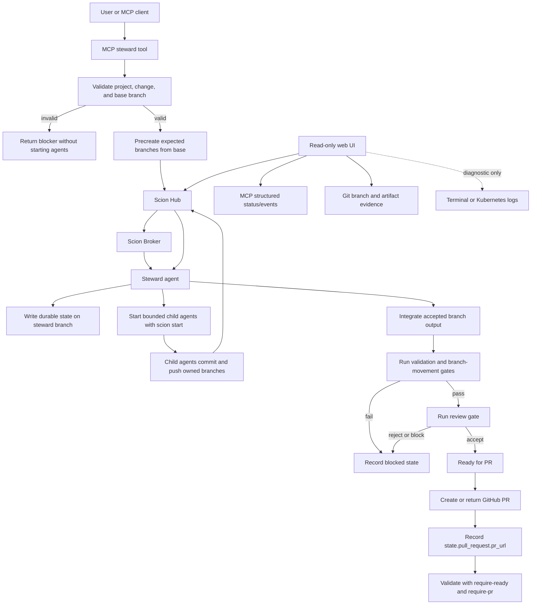

# OpenSpec Operations

scion-ops uses OpenSpec as the contract between planning rounds and
implementation rounds.

The preferred workflow is Scion-native stewardship: a long-running steward owns
the session, records durable state, delegates bounded work to specialist agents,
and uses deterministic validation/review gates before declaring a branch ready.
For OpenSpec work, steward sessions are the documented path.

## Expected Interaction Flow



The normal observation path is structured Hub, MCP, Git, and steward-state data.
Terminal output and Kubernetes logs are diagnostic-only fallbacks; they are not
workflow state and must not decide readiness.

## Artifact Contract

A spec steward session writes only:

```text
openspec/changes/<change>/proposal.md
openspec/changes/<change>/design.md
openspec/changes/<change>/tasks.md
openspec/changes/<change>/specs/**/spec.md
```

It must not implement code, tests, manifests, product docs, or runtime scripts.

`tasks.md` must use checkbox tasks. At least one delta spec must include one of:

- `## ADDED Requirements`
- `## MODIFIED Requirements`
- `## REMOVED Requirements`

Delta specs use:

- `### Requirement: <name>`
- `#### Scenario: <name>`

## Steward Shell Workflow

Start a spec steward session:

```bash
task bootstrap -- /path/to/project

SCION_OPS_PROJECT_ROOT=/path/to/project \
SCION_OPS_SPEC_CHANGE=add-widget \
task spec:steward -- "Specify the widget behavior."
```

Render the prompt without starting agents:

```bash
SCION_OPS_PROJECT_ROOT=/path/to/project \
SCION_OPS_SPEC_CHANGE=add-widget \
task spec:steward:dry-run -- "Specify the widget behavior."
```

Validate artifacts:

```bash
task spec:validate -- --project-root /path/to/project --change add-widget
```

Validate steward session state after the steward reports ready:

```bash
task steward:validate -- \
  --project-root /path/to/project \
  --session-id <session-id> \
  --kind spec \
  --change add-widget \
  --require-ready
```

Create or return the review PR after validation succeeds. Successful steward
sessions record the PR URL in `state.pull_request.pr_url`:

```bash
task steward:pr -- \
  --project-root /path/to/project \
  --session-id <session-id> \
  --kind spec \
  --change add-widget \
  --json
```

Validate completed reviewable state after PR creation:

```bash
task steward:validate -- \
  --project-root /path/to/project \
  --session-id <session-id> \
  --kind spec \
  --change add-widget \
  --require-ready \
  --require-pr
```

Start implementation after the spec PR is merged or after the approved spec
branch is selected:

```bash
task bootstrap -- /path/to/project

SCION_OPS_PROJECT_ROOT=/path/to/project \
task spec:implement -- --change add-widget "Implement the approved change."
```

Render the implementation prompt without starting agents:

```bash
SCION_OPS_PROJECT_ROOT=/path/to/project \
task spec:implement:dry-run -- --change add-widget "Implement the approved change."
```

Validate implementation steward state:

```bash
task steward:validate -- \
  --project-root /path/to/project \
  --session-id <session-id> \
  --kind implementation \
  --change add-widget \
  --require-ready
```

Create or return the implementation PR after validation succeeds:

```bash
task steward:pr -- \
  --project-root /path/to/project \
  --session-id <session-id> \
  --kind implementation \
  --change add-widget \
  --json
```

Validate completed implementation state after PR creation:

```bash
task steward:validate -- \
  --project-root /path/to/project \
  --session-id <session-id> \
  --kind implementation \
  --change add-widget \
  --require-ready \
  --require-pr
```

Archive after the implementation PR is merged:

```bash
task spec:archive -- --project-root /path/to/project --change add-widget
task spec:archive -- --project-root /path/to/project --change add-widget --yes
```

The archive command syncs accepted delta specs into `openspec/specs/` and moves
the change folder under `openspec/changes/archive/`.

## MCP Workflow

For Zed and other MCP clients, keep the request small:

```text
Use scion-ops on project_root=/path/to/project.

Run a spec steward session for change=add-widget:
"Specify the widget behavior."
```

The external-agent tool for spec work is `scion_ops_start_spec_steward`. Monitor
the session with `scion_ops_watch_round_events` and validate readiness with
`scion_ops_validate_steward_session`. After readiness validation passes, call
`scion_ops_finalize_steward_pr` to create or return the GitHub PR, then validate
again with `require_pr=true` when you need the terminal reviewable contract.

When `base_branch` is omitted, steward MCP tools choose the repository's origin
default branch, then `main`/`master`. This keeps new steward sessions off stale
round branches while preserving explicit caller control.

Implementation request:

```text
Use scion-ops on project_root=/path/to/project.

Validate change=add-widget, then start an implementation round from that
approved spec:
"Implement the approved change."
```

The implementation tool is `scion_ops_start_impl_round`. It starts the
implementation steward path and validates the approved change before launch.
Validate the final state with `scion_ops_validate_steward_session`, then call
`scion_ops_finalize_steward_pr`, then validate again with `require_pr=true`.

Archive request:

```text
Use scion-ops on project_root=/path/to/project.

Archive accepted OpenSpec change=add-widget and show the plan only.
```

Apply archive only when the plan is correct:

```text
Apply the OpenSpec archive for change=add-widget with confirm=true.
```

## Review Requirements

Spec PR review checks:

- only `openspec/changes/<change>/` artifacts changed
- `proposal.md`, `design.md`, `tasks.md`, and at least one delta spec exist
- requirements and scenarios are concrete enough to implement
- unresolved questions are explicit
- operational verification expectations are represented in `tasks.md`

Implementation PR review checks:

- implementation follows the approved artifacts
- `tasks.md` is updated for completed work
- scope drift is treated as blocking
- target repo verification passed

## Final Review Repair

Before final review starts, the integrator must hand off the integration branch
and commit under review, canonical verification commands, observed results, and
known caveats or environment assumptions. Missing commands or results block
final review startup as a handoff correction; they are not implementation or
integration defects by themselves.

Failed final reviews are classified as exactly one of:

- `implementation_defect`
- `integration_defect`
- `verification_contract`
- `environment_failure`
- `transient_agent_failure`

The coordinator tracks `max_final_repair_rounds` separately from earlier
implementation, peer-review, and integration repair budgets. Implementation
defects return to focused implementation repair and peer review before
reintegration. Integration defects return to integrator repair and a refreshed
handoff. Verification-contract corrections, environment failures, and transient
agent failures preserve otherwise accepted integration branches unless later
evidence exposes a separate implementation or integration defect.

## Runtime Dependency Policy

The MCP runtime includes the pinned OpenSpec CLI and uses it for canonical
`validate` and `status` results when available. The repo-local Python validator
remains the fallback for local development and for environments where the CLI is
not present.

Archive remains script-based for now because the local command gives us a
previewable, JSON result before moving files under `openspec/changes/archive/`.
